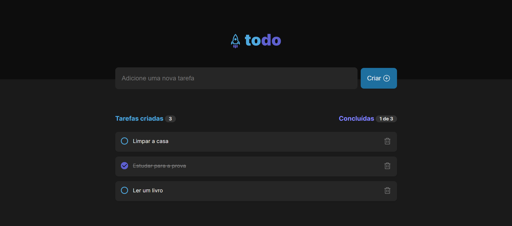
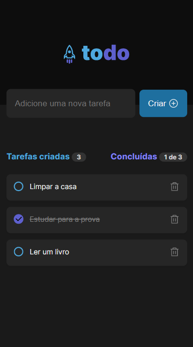

# ToDo App

Todo is a simple app created with React that lets you add taks to a list and check them when you have completed it. This app is part of a course called "Ignite" where this is the first challenge of the course. I plan to add more features in the future.

## Desktop preview:

  
 ## Mobile preview:

  
